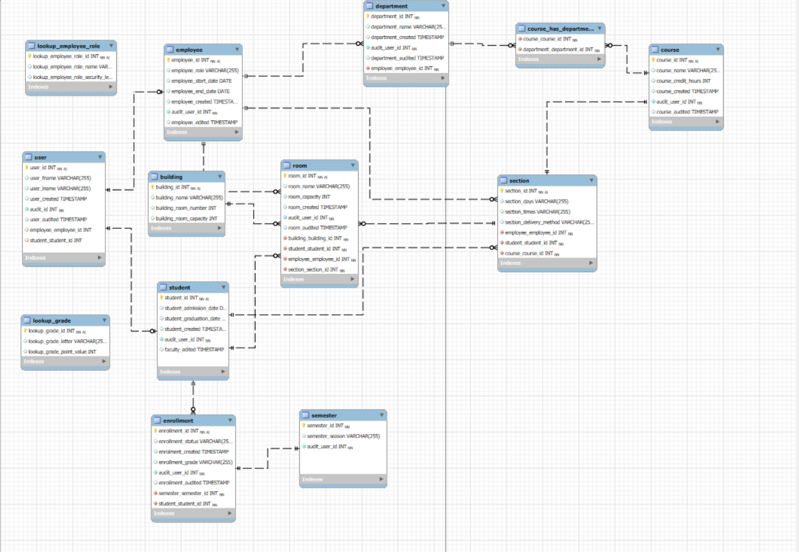
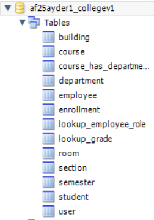

# 📚 Student Information System Database

A relational Student Information System (SIS) database designed for Students, Faculty, and Admins to manage grades, enrollment, courses, rooms, and departments.

## Table of Contents

- [Role Features](#role-features)
  - [Students](#students)
  - [Faculty](#faculty)
- [Entity–Relationship Model](#entity–relationship-model)
  - [Diagram](#diagram)
  - [Key Tables](#key-tables)
- [Tech Stack](#tech-stack)
- [Setup](#setup)
- [Authors](#authors)

## Role Features

### Students

View grades and enrollment status.

Access course and section details they are linked to.

### Faculty

View and update grades for students they teach.

Manage sections they are assigned to.

View departmental and course relationships.

## Entity–Relationship Model

The schema enforces role-based access, integrity, and scalability.

### Diagram

Below are the exported diagrams from MySQL Workbench. Click the images to view the full-size versions.

[](assets/EER_Diagram.png)
*EER Diagram — shows tables and relationships.*

[](assets/Catalog_Tree.png)
*Catalog Tree — shows the list of tables in the generated schema.*

### Key Tables

- `user` – Authentication & link to student / employee.
- `student` – Admissions, graduation, enrollment link.
- `employee` – Faculty/Admin records with roles.
- `department` – Academic departments.
- `course` – Courses with credit hours.
- `section` – Course offerings, linked to faculty/students.
- `enrollment` – Tracks student enrollment status.
- `semester` – Current and archived academic terms.
- `room` / `building` – Physical classroom resources.
- Lookups – Employee roles, grades.

## Tech Stack

- Database: MySQL / MariaDB
- Modeling: MySQL Workbench (Forward Engineering)

## Setup

Clone the repository:

```powershell
git clone https://github.com/onmosa01/CollegeV1/
cd CollegeV1
```

Import the .sql schema into MySQL Workbench.

Run the script to create tables and relationships.

## Authors

[Ayden Riddle](https://www.github.com/ayridd03)
[Nathan Mulholland](https://github.com/Beast1692)
[Onalenna Mosadi](https://github.com/onmosa01)
